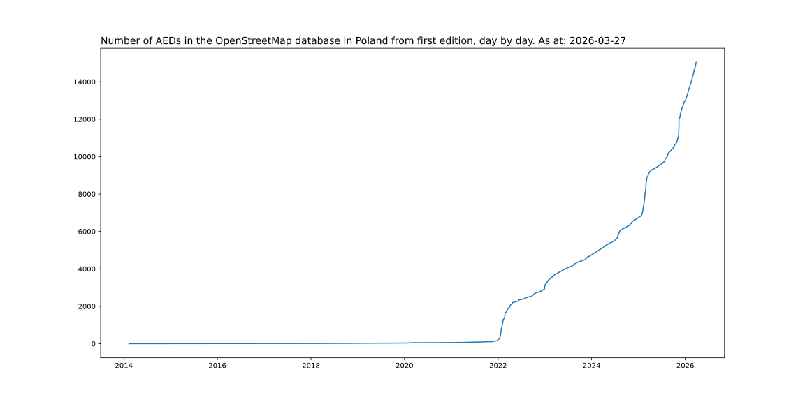
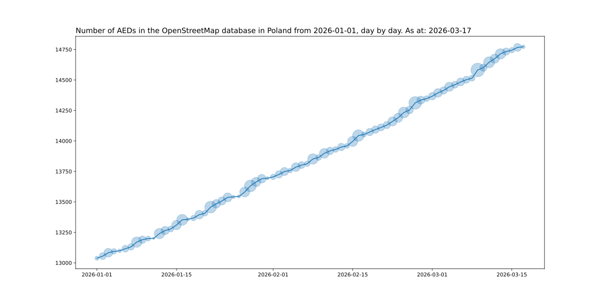
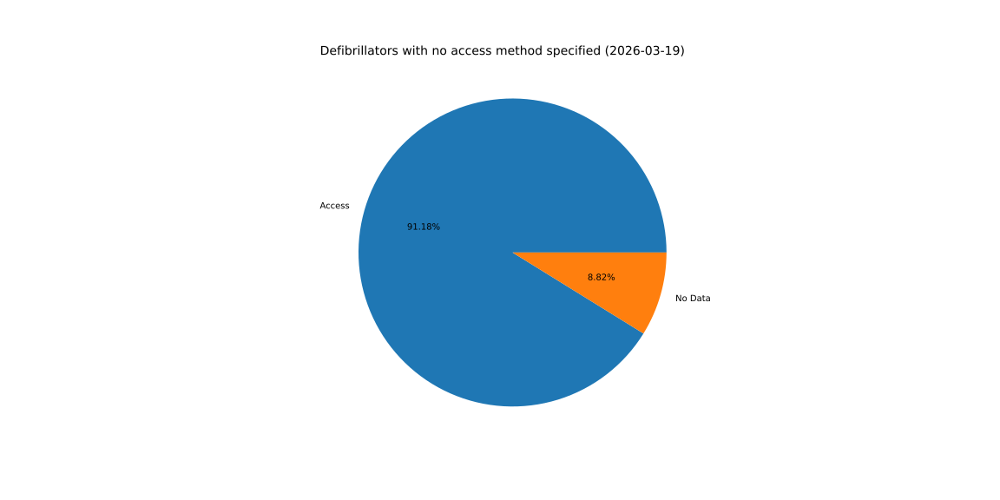
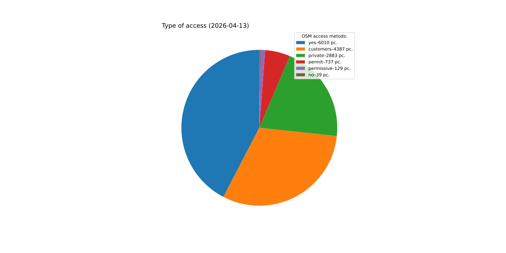
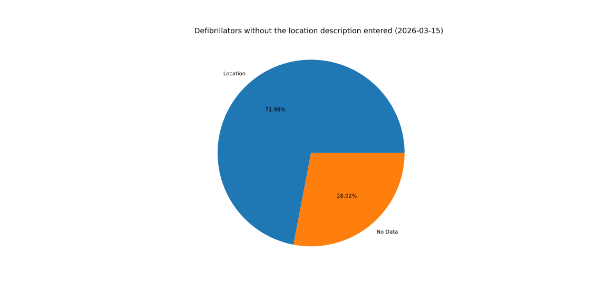

# AED backup and stats (2025-09-27 07:12:40)

## Total AED plot

Total AED: 11971

## Current year AED plot
\
AED for 2025-01-01: 7741\
Average daily growth since beginning of the year: 16.21

## Top creators
| # | User | Created |
| ------------- | ------------- | ------------- |
| 1 | [Patryk2710](<https://www.openstreetmap.org/user/Patryk2710>) | 2665 |
| 2 | [Marek-M](<https://www.openstreetmap.org/user/Marek-M>) | 856 |
| 3 | [Mordechai23](<https://www.openstreetmap.org/user/Mordechai23>) | 716 |
| 4 | [ptarac](<https://www.openstreetmap.org/user/ptarac>) | 549 |
| 5 | [voltairovicz](<https://www.openstreetmap.org/user/voltairovicz>) | 370 |
| 6 | [Aleksander &#124; Yanosik](<https://www.openstreetmap.org/user/Aleksander &#124; Yanosik>) | 355 |
| 7 | [Ronczka](<https://www.openstreetmap.org/user/Ronczka>) | 343 |
| 8 | [Cristoffs](<https://www.openstreetmap.org/user/Cristoffs>) | 333 |
| 9 | [Sebastian &#124; Yanosik](<https://www.openstreetmap.org/user/Sebastian &#124; Yanosik>) | 156 |
| 10 | [user_4493657](<https://www.openstreetmap.org/user/user_4493657>) | 144 |
| 11 | [RicoElectrico](<https://www.openstreetmap.org/user/RicoElectrico>) | 132 |
| 12 | [PGRM Biuro](<https://www.openstreetmap.org/user/PGRM Biuro>) | 101 |
| 13 | [Aim311_](<https://www.openstreetmap.org/user/Aim311_>) | 97 |
| 14 | [syntex](<https://www.openstreetmap.org/user/syntex>) | 97 |
| 15 | [polar7](<https://www.openstreetmap.org/user/polar7>) | 88 |
| 16 | [Ancymon](<https://www.openstreetmap.org/user/Ancymon>) | 80 |
| 17 | [NieWnen](<https://www.openstreetmap.org/user/NieWnen>) | 54 |
| 18 | [pedro's](<https://www.openstreetmap.org/user/pedro's>) | 45 |
| 19 | [KPP PSP Działdowo](<https://www.openstreetmap.org/user/KPP PSP Działdowo>) | 44 |
| 20 | [charl3s](<https://www.openstreetmap.org/user/charl3s>) | 43 |
| 21 | [serdelll](<https://www.openstreetmap.org/user/serdelll>) | 41 |
| 22 | [starsep](<https://www.openstreetmap.org/user/starsep>) | 41 |
| 23 | [lama99](<https://www.openstreetmap.org/user/lama99>) | 40 |
| 24 | [michalgwo](<https://www.openstreetmap.org/user/michalgwo>) | 39 |
| 25 | [Defibrylatorek](<https://www.openstreetmap.org/user/Defibrylatorek>) | 38 |

## Tag access pie

## Tag access details pie

## Tag location pie

