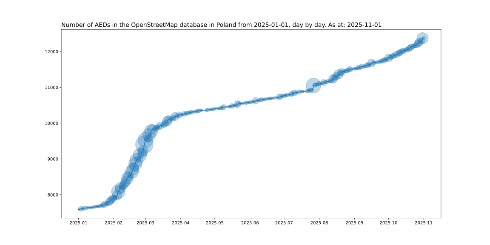

# AED backup and stats (2026-01-10 15:15:41)

## Total AED plot

Total AED: 13463

## Current year AED plot
\
AED for 2026-01-01: 13296\
Average daily growth since beginning of the year: 17.40

## Top creators
| # | User | Created |
| ------------- | ------------- | ------------- |
| 1 | [Patryk2710](<https://www.openstreetmap.org/user/Patryk2710>) | 3343 |
| 2 | [Marek-M](<https://www.openstreetmap.org/user/Marek-M>) | 857 |
| 3 | [Mordechai23](<https://www.openstreetmap.org/user/Mordechai23>) | 716 |
| 4 | [ptarac](<https://www.openstreetmap.org/user/ptarac>) | 549 |
| 5 | [voltairovicz](<https://www.openstreetmap.org/user/voltairovicz>) | 371 |
| 6 | [Aleksander &#124; Yanosik](<https://www.openstreetmap.org/user/Aleksander &#124; Yanosik>) | 355 |
| 7 | [Ronczka](<https://www.openstreetmap.org/user/Ronczka>) | 343 |
| 8 | [Cristoffs](<https://www.openstreetmap.org/user/Cristoffs>) | 333 |
| 9 | [Sebastian &#124; Yanosik](<https://www.openstreetmap.org/user/Sebastian &#124; Yanosik>) | 156 |
| 10 | [user_4493657](<https://www.openstreetmap.org/user/user_4493657>) | 144 |
| 11 | [RicoElectrico](<https://www.openstreetmap.org/user/RicoElectrico>) | 133 |
| 12 | [PGRM Biuro](<https://www.openstreetmap.org/user/PGRM Biuro>) | 128 |
| 13 | [Aim311_](<https://www.openstreetmap.org/user/Aim311_>) | 110 |
| 14 | [pedro's](<https://www.openstreetmap.org/user/pedro's>) | 101 |
| 15 | [syntex](<https://www.openstreetmap.org/user/syntex>) | 97 |
| 16 | [polar7](<https://www.openstreetmap.org/user/polar7>) | 88 |
| 17 | [Ancymon](<https://www.openstreetmap.org/user/Ancymon>) | 82 |
| 18 | [Bartek444](<https://www.openstreetmap.org/user/Bartek444>) | 81 |
| 19 | [NieWnen](<https://www.openstreetmap.org/user/NieWnen>) | 55 |
| 20 | [charl3s](<https://www.openstreetmap.org/user/charl3s>) | 44 |
| 21 | [KPP PSP Działdowo](<https://www.openstreetmap.org/user/KPP PSP Działdowo>) | 44 |
| 22 | [starsep](<https://www.openstreetmap.org/user/starsep>) | 42 |
| 23 | [Defibrylatorek](<https://www.openstreetmap.org/user/Defibrylatorek>) | 41 |
| 24 | [serdelll](<https://www.openstreetmap.org/user/serdelll>) | 41 |
| 25 | [lama99](<https://www.openstreetmap.org/user/lama99>) | 40 |

## Tag access pie

## Tag access details pie

## Tag location pie

