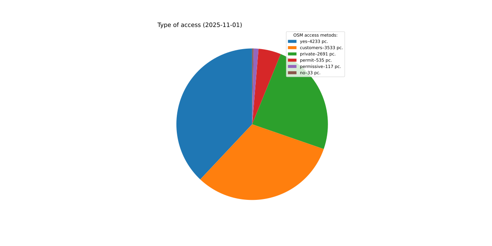

# AED backup and stats (2022-03-28 21:33:07)

## Total AED plot

Total AED: 3018

## Current year AED plot
\
AED for 2022-01-01: 397\
Average daily growth since beginning of the year: 31.31

## Top creators
| # | User | Created |
| ------------- | ------------- | ------------- |
| 1 | [Mordechai23](<https://www.openstreetmap.org/user/Mordechai23>) | 710 |
| 2 | [Ronczka](<https://www.openstreetmap.org/user/Ronczka>) | 343 |
| 3 | [voltairovicz](<https://www.openstreetmap.org/user/voltairovicz>) | 313 |
| 4 | [Aleksander &#124; Yanosik](<https://www.openstreetmap.org/user/Aleksander &#124; Yanosik>) | 226 |
| 5 | [Aim311](<https://www.openstreetmap.org/user/Aim311>) | 135 |
| 6 | [ptarac](<https://www.openstreetmap.org/user/ptarac>) | 123 |
| 7 | [syntex](<https://www.openstreetmap.org/user/syntex>) | 98 |
| 8 | [Ancymon](<https://www.openstreetmap.org/user/Ancymon>) | 64 |
| 9 | [lama99](<https://www.openstreetmap.org/user/lama99>) | 41 |
| 10 | [charl3s](<https://www.openstreetmap.org/user/charl3s>) | 39 |
| 11 | [RicoElectrico](<https://www.openstreetmap.org/user/RicoElectrico>) | 39 |
| 12 | [serdelll](<https://www.openstreetmap.org/user/serdelll>) | 35 |
| 13 | [pedro's](<https://www.openstreetmap.org/user/pedro's>) | 33 |
| 14 | [Marek-M](<https://www.openstreetmap.org/user/Marek-M>) | 28 |
| 15 | [krzysmek](<https://www.openstreetmap.org/user/krzysmek>) | 25 |
| 16 | [cedaros](<https://www.openstreetmap.org/user/cedaros>) | 24 |
| 17 | [Olga &#124; Yanosik](<https://www.openstreetmap.org/user/Olga &#124; Yanosik>) | 22 |
| 18 | [Marek Janowski](<https://www.openstreetmap.org/user/Marek Janowski>) | 20 |
| 19 | [Brian@Brea](<https://www.openstreetmap.org/user/Brian@Brea>) | 20 |
| 20 | [Mentisekk](<https://www.openstreetmap.org/user/Mentisekk>) | 19 |
| 21 | [KrissPSP](<https://www.openstreetmap.org/user/KrissPSP>) | 15 |
| 22 | [lukubuku](<https://www.openstreetmap.org/user/lukubuku>) | 15 |
| 23 | [Adam_Piszczek](<https://www.openstreetmap.org/user/Adam_Piszczek>) | 15 |
| 24 | [szejnerkarol](<https://www.openstreetmap.org/user/szejnerkarol>) | 13 |
| 25 | [Michoo](<https://www.openstreetmap.org/user/Michoo>) | 12 |

## Tag access pie

## Tag access details pie

## Tag location pie

